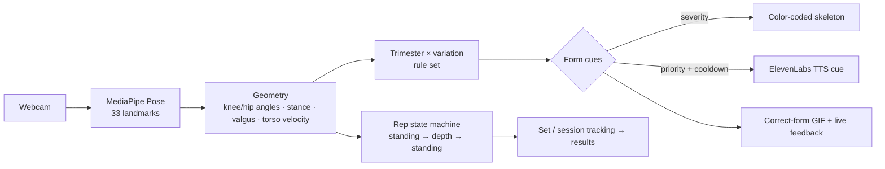

# 🌸 Juno — Trauma-Informed Prenatal Squat Coach

[](https://squat-form-analyzer.vercel.app)
[](#-team)
[](#-tech-stack)

> **Move safely. Feel confident.**
> A gentle, camera-based AI coach that watches your form in real time and guides you through pregnancy-safe squats — out loud, hands-free, and personalized to your trimester.

**[→ Live Demo](https://squat-form-analyzer.vercel.app)**

Juno turns any laptop webcam into a prenatal personal trainer. It tracks your body with **MediaPipe Pose**, scores every rep against **ACOG / Healthline–grounded** medical rules tuned to your trimester, speaks coaching cues with **ElevenLabs voice**, and lets you **ask questions out loud mid-workout** — all wrapped in a calm, trauma-informed interface.

---

## ✨ Features

- **Real-time form analysis** — 33-point pose tracking at camera frame rate; live knee & hip angles, stance width, and knee-valgus detection drive a color-coded skeleton (green → adjust → stop).
- **Trimester-aware coaching** — depth windows, stance, and breathing cadence shift across 1st / 2nd / 3rd trimester. Relaxin-driven joint laxity means stricter knee-tracking thresholds — never push depth.
- **Spoken cues, hands-free** — *"Keep your weight in your heels," "Lift tall through your chest," "Steady breathing."* Delivered by ElevenLabs TTS with priority + cooldown so cues never talk over each other.
- **Voice Q&A, any time** — tap the mic between sets **or mid-workout** to ask about form, breathing, or setup. ElevenLabs **Scribe** transcribes → curated FAQ answers → spoken reply.
- **Correct-form reference** — a medically-reviewed Healthline squat demo sits beside the camera and its tip tracks whatever you're being coached on right now.
- **Rep & set tracking** — a standing → depth → standing state machine counts clean reps and runs a 3-set session with between-set breaks.
- **High-impact safety** — torso-velocity detection flags jumping / jerky motion as an *additive* warning that never blocks the normal form coaching.
- **Pause / Resume** — freeze the timer, analysis, and voice at any moment; resume cleanly with no cue backlog.
- **Trauma-informed onboarding** — pregnancy status, trimester, experience, fitness level, and doctor-clearance gate the experience; not cleared → a gentle breathing & education mode instead of live coaching.
- **Safety first** — an always-available ACOG stop-sign panel (dizziness, bleeding, contractions…) and a "this is not medical advice" posture throughout.
- **Polished, calm UI** — glassmorphism, mesh gradients, and an animated, accessible design system built on shadcn/ui + Radix.

---

## 🧠 How it works



Every frame, pose landmarks become geometric metrics, those metrics are checked against a rule set **merged from your trimester and chosen squat variation**, and the resulting cues drive the skeleton color, the spoken coaching, the reference panel, and the rep counter.

---

## 🛠 Tech Stack

| Layer | Technology |
|---|---|
| **Frontend** | React 19, TypeScript, Vite 7 |
| **Framework** | TanStack Start (SSR), TanStack Router, TanStack React Query |
| **Pose / CV** | MediaPipe Pose, Camera Utils, Drawing Utils |
| **Voice AI** | ElevenLabs — TTS (`eleven_flash_v2_5`) + STT (`scribe_v1`) |
| **Styling** | Tailwind CSS v4, shadcn/ui, Radix UI, glassmorphism utilities |
| **UI / Charts** | Lucide icons, Recharts, Sonner toasts |
| **Forms** | React Hook Form, Zod |
| **Server runtime** | Nitro v3 (Vercel preset) — server routes for TTS/STT proxy |
| **Deployment** | Vercel (frontend + serverless functions) |

---

## 📡 API Reference

Server routes (TanStack Start handlers, deployed as Vercel functions) keep the ElevenLabs key server-side.

| Endpoint | Description |
|---|---|
| `POST /api/tts` | Text → speech via ElevenLabs (`eleven_flash_v2_5`); returns `audio/mpeg` |
| `POST /api/stt` | Recorded audio → transcript via ElevenLabs Scribe (`scribe_v1`); returns `{ text }` |

---

## 🩺 Medical model

Coaching rules are grounded in **ACOG ("Exercise During Pregnancy")** and **Healthline's medically-reviewed prenatal-squat guidance**: keep weight in the heels, never force depth, watch for knee valgus (relaxin raises joint laxity), and stop at the first warning sign.

**Depth & cadence by trimester** (knee angle is hip–knee–ankle; smaller = deeper):

| Trimester | Depth window (min–max°) | Stance | Breath reminder |
|---|---|---|---|
| 1st | 90 – 130 | shoulder-width | every 30s |
| 2nd | 100 – 130 | slightly wider | every 25s |
| 3rd | 110 – 140 | wider | every 20s |

**Form cues** detected per frame: `knees_over_toes` · `back_straight` · `knees_caving` · `too_deep` · `good_depth` · `chest_up` · `squeeze_glutes` · `remember_to_breathe` · `high_impact`.

---

## 📁 Project Structure

```
squat-form-analyzer/  (repo: Jade-Leong/teamFour)
├── src/
│   ├── routes/
│   │   ├── __root.tsx              # Document shell, head/meta, favicon, providers
│   │   ├── index.tsx              # Landing
│   │   ├── onboarding.tsx          # Trauma-informed intake (status/trimester/clearance)
│   │   ├── workout.$id.tsx         # Live coaching: pose, cues, pause, voice Q&A
│   │   ├── dashboard.tsx / progress.tsx / results.tsx / mood.tsx
│   │   ├── login.tsx / signup.tsx / profile.tsx / coach.tsx
│   │   └── api/
│   │       ├── tts.ts              # ElevenLabs text-to-speech proxy
│   │       └── stt.ts              # ElevenLabs Scribe speech-to-text proxy
│   ├── lib/
│   │   ├── pregnancyRules.ts       # Rule tables, pose math, cue detection, form GIFs
│   │   ├── voice.ts                # Client TTS/STT helpers + anti-overlap cooldowns
│   │   └── faq.ts                  # Curated Q&A matcher
│   ├── context/UserProfileContext.tsx
│   └── components/ui/              # shadcn/ui component library
├── vite.config.ts                  # TanStack Start + Nitro (Vercel preset)
└── vercel.json / .npmrc
```

---

## 🚀 Getting Started

**Prerequisites:** Node 18+ and an [ElevenLabs](https://elevenlabs.io) API key (for voice).

```bash
# 1. Install (the lockfile needs legacy peer resolution)
npm install --legacy-peer-deps

# 2. Configure voice (create .env in the project root)
cat > .env <<'EOF'
ELEVENLABS_API_KEY=your_key_here
ELEVENLABS_VOICE_ID=EXAVITQu4vr4xnSDxMaL
EOF

# 3. Run the dev server
npm run dev          # → http://localhost:8080
```

Allow camera (and microphone, for voice Q&A) access when prompted, then **Begin Workout**.

### Deploy (Vercel)

```bash
vercel --prod
```

Set `ELEVENLABS_API_KEY` and `ELEVENLABS_VOICE_ID` in the Vercel project's environment variables. The build uses the **Nitro Vercel preset** (pinned in `vite.config.ts`) so SSR + `/api/*` routes deploy as serverless functions.

---

## ⚠️ Safety & disclaimer

Juno is a fitness aid, **not a substitute for medical advice**. Always follow your clinician's recommendations, and **stop immediately** if you feel dizziness, pain, vaginal bleeding, shortness of breath, racing heartbeat, chest pain, fluid leaking, uterine contractions, or muscle cramps — then contact your healthcare provider.

---

## 👥 Team

Built for the **VibeHack — Health Tech AI Hackathon**. 💜
Repository: [`Jade-Leong/teamFour`](https://github.com/Jade-Leong/teamFour)

*Pose intelligence × pregnancy-safe medicine × a voice that actually coaches you.*
